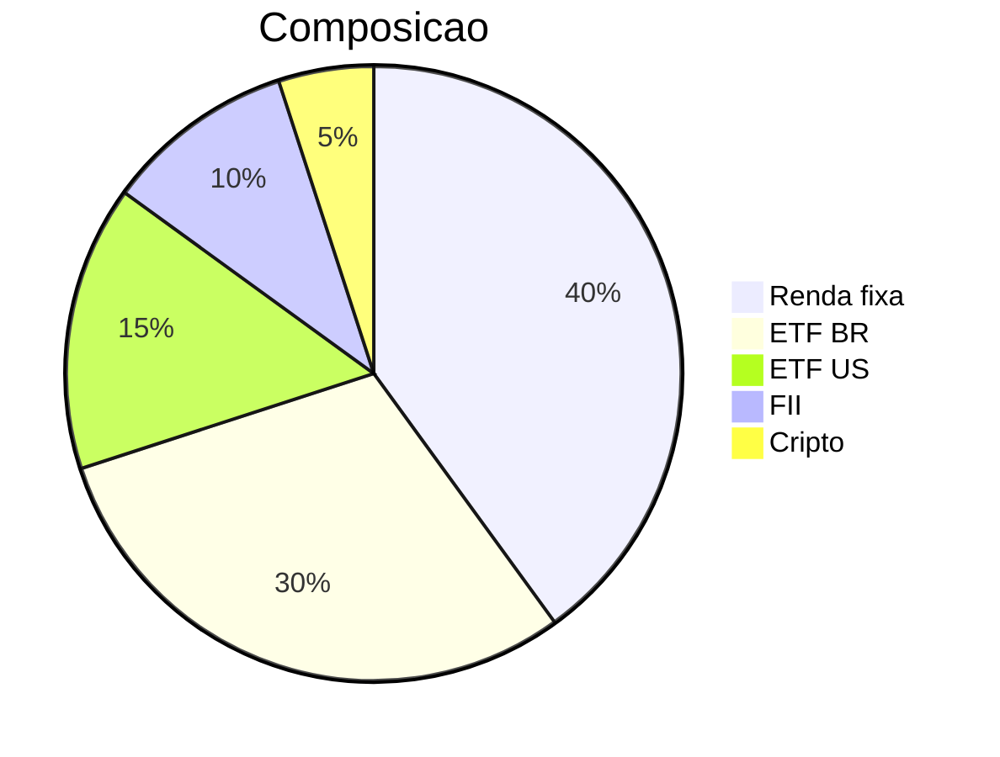
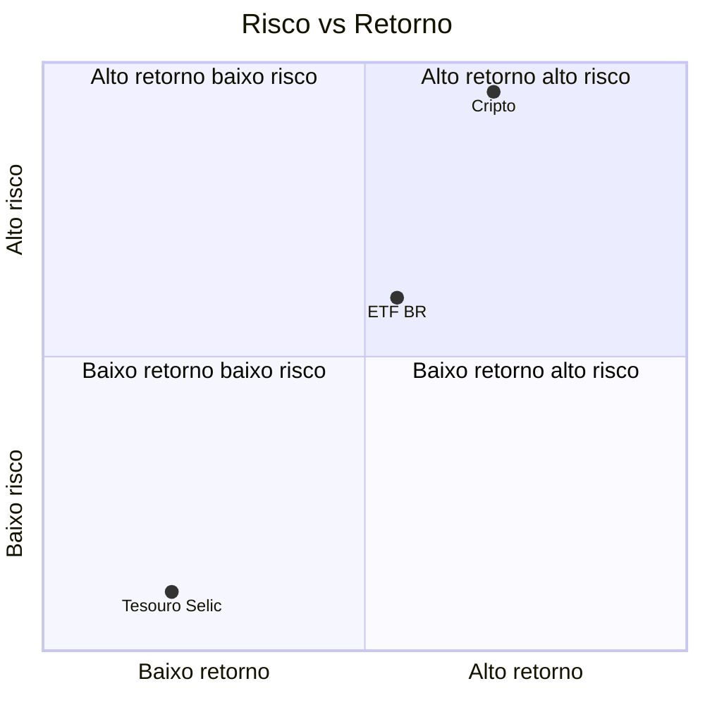

# Framework — Visualização de dados

Use sempre que produzir uma análise e o tipo for `investimento` (gatilho automático), ou quando o usuário pedir explicitamente em análises `pessoal` ou `empresarial`. Este framework define o catálogo de gráficos, regras de quando renderizar, e como renderizar por plataforma.

## Princípio fundamental

Visual é **complementar**, nunca substituto. A tabela numérica original da seção correspondente permanece sempre obrigatória. O gráfico se soma para tornar padrões visíveis.

## Gatilho (D1 do spec)

- Tipo `investimento` → renderiza tudo que satisfaça pré-requisito de dados
- Tipo `pessoal` ou `empresarial` → renderiza apenas se o usuário usar uma das frases-gatilho: "visualize", "mostre o gráfico", "compare graficamente", "gráfico", "diagrama"
- Tipo `misto` → segue regra do componente investimento se houver; caso contrário opt-in

## Catálogo

### Catálogo: Radar (V1)

- **Onde aparece:** dentro da Seção 3, após a tabela de scores
- **Pré-requisito:** Seção 3 contém 3 ou mais dimensões com score 1-5
- **Eixos:** as próprias dimensões da tabela (Risco, Retorno esperado, Liquidez, Alinhamento com perfil, Qualidade quando aplicável)
- **Domínio:** 1 a 5
- **Cor:** verde-azulado `#0d9488` para a série principal; cinza neutro `#475569` para benchmark/referência se houver

### Catálogo: Pizza / donut (V2)

- **Onde aparece:**
  - Após premissa de composição na Seção 2 quando a alocação é **input** (carteira existente)
  - Dentro da Seção 6 quando a alocação é **output** (recomendação)
- **Pré-requisito:** dados de alocação com 2 ou mais categorias somando aproximadamente 100% (tolerância ±2pp)
- **Cor:** paleta determinística (ver abaixo) ordenada por nível de risco crescente

### Catálogo: Quadrante risco × retorno (V3)

- **Onde aparece:** dentro da Seção 5, após a tabela de comparação
- **Pré-requisito:** Seção 5 compara 3 ou mais opções com risco e retorno qualitativos (mapeáveis para baixo/médio/alto)
- **Eixos:** X = retorno esperado (baixo→alto), Y = risco (baixo→alto)
- **Cor:** verde-azulado para opções no quadrante baixo-risco-alto-retorno; âmbar/vermelho conforme risco

## Invariantes (D4 do spec)

1. **Complementar, não substituto** — a tabela numérica da seção original permanece obrigatória
2. **Sem valores absolutos** — pizza usa %, radar usa score 1-5, quadrante usa qualitativo mapeado. Aplica o protocolo anti-PII do `AGENT.md`.
3. **Caption obrigatória** — 1-2 linhas em itálico abaixo de cada gráfico dizendo o **insight**, não o eixo. Ver exemplos abaixo.
4. **Determinismo** — mesma entrada produz mesma cor e mesma ordem de categorias

### Caption interpretativa: ✅ vs ❌

✅ Bom:
> _O eixo Liquidez puxa o radar pra baixo — esse é o trade-off que precisa ser aceito conscientemente._

❌ Ruim (descritivo):
> _Gráfico de scores em 5 dimensões._

✅ Bom:
> _Concentração de 60% em renda variável doméstica indica viés de país — o eixo internacional do quadrante mostra o gap._

❌ Ruim (genérico):
> _Pizza mostrando a composição da carteira._

## Quando NÃO renderizar (D3 do spec)

O agente **não** gera o gráfico quando qualquer um for verdadeiro:

- Pré-requisito de dados não satisfeito — registrar no sub-item "Dados ausentes que mudariam a análise" da Seção 7 do output review-ready
- Renderização exigiria expor valor absoluto que viola anti-PII
- Plataforma corrente não oferece renderização daquele tipo (ver capability matrix abaixo) — neste caso, declarar abertamente: "Visualização V_n_ indisponível nesta plataforma; ver tabela acima."

## Paleta determinística

| Função semântica | Hex |
|---|---|
| Favorável / baixo risco | `#0d9488` (verde-azulado) |
| Neutro / risco médio | `#d97706` (âmbar) |
| Desfavorável / alto risco | `#dc2626` (vermelho) |
| Referência / benchmark | `#475569` (cinza neutro) |

## Capability matrix por plataforma (D5 do spec)

| Plataforma | V1 Radar | V2 Pizza | V3 Quadrante |
|---|---|---|---|
| Claude (Projects, Cowork) | Artifact React + Recharts `<RadarChart>` | Artifact React + Recharts `<PieChart>` | Artifact React + Recharts `<ScatterChart>` |
| ChatGPT (Custom GPT com Code Interpreter) | matplotlib `polar` via Code Interpreter | matplotlib `pie` | matplotlib scatter com anotações |
| Copilot e demais | **Indisponível — declarar** | Mermaid `pie` | Mermaid `quadrantChart` |

## Receitas de renderização

### Claude — Artifact React (V1 Radar)

```jsx
import { RadarChart, PolarGrid, PolarAngleAxis, PolarRadiusAxis, Radar, ResponsiveContainer } from 'recharts';
const data = [
  { dim: 'Risco', score: 3 },
  { dim: 'Retorno', score: 4 },
  { dim: 'Liquidez', score: 2 },
  { dim: 'Alinhamento', score: 5 },
];
export default () => (
  <ResponsiveContainer width="100%" height={300}>
    <RadarChart data={data}>
      <PolarGrid /><PolarAngleAxis dataKey="dim" /><PolarRadiusAxis domain={[0,5]} />
      <Radar dataKey="score" stroke="#0d9488" fill="#0d9488" fillOpacity={0.5} />
    </RadarChart>
  </ResponsiveContainer>
);
```

### Claude — Artifact React (V2 Pizza)

```jsx
import { PieChart, Pie, Cell, ResponsiveContainer } from 'recharts';
const data = [
  { name: 'Renda fixa', value: 40, fill: '#0d9488' },
  { name: 'ETF BR', value: 30, fill: '#d97706' },
  { name: 'ETF US', value: 15, fill: '#d97706' },
  { name: 'FII', value: 10, fill: '#d97706' },
  { name: 'Cripto', value: 5, fill: '#dc2626' },
];
export default () => (
  <ResponsiveContainer width="100%" height={300}>
    <PieChart><Pie data={data} dataKey="value" nameKey="name" innerRadius={60} outerRadius={100} label /></PieChart>
  </ResponsiveContainer>
);
```

### ChatGPT — matplotlib (V1 Radar)

```python
import matplotlib.pyplot as plt
import numpy as np
dims = ['Risco','Retorno','Liquidez','Alinhamento']
scores = [3, 4, 2, 5]
angles = np.linspace(0, 2*np.pi, len(dims), endpoint=False).tolist()
scores += scores[:1]; angles += angles[:1]
fig, ax = plt.subplots(subplot_kw=dict(polar=True))
ax.plot(angles, scores, color='#0d9488'); ax.fill(angles, scores, color='#0d9488', alpha=0.5)
ax.set_xticks(angles[:-1]); ax.set_xticklabels(dims); ax.set_ylim(0,5)
plt.show()
```

### Copilot — Mermaid (V2 Pizza)



### Copilot — Mermaid (V3 Quadrante)


